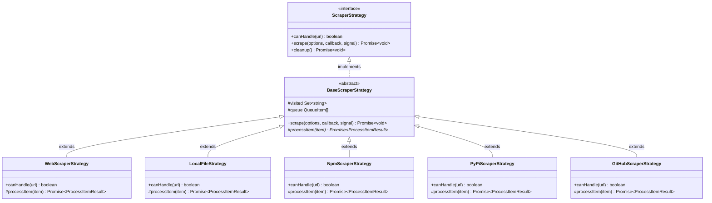
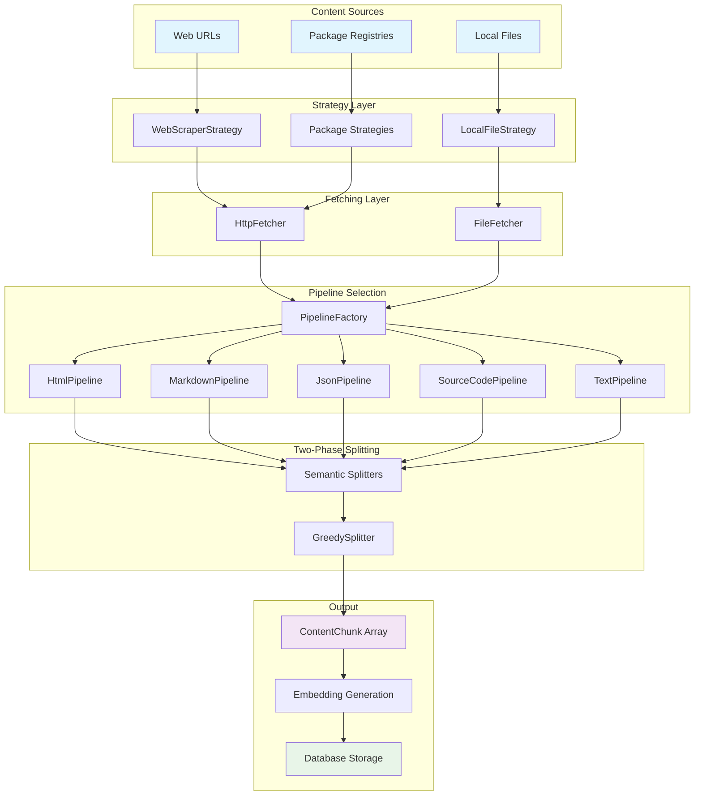
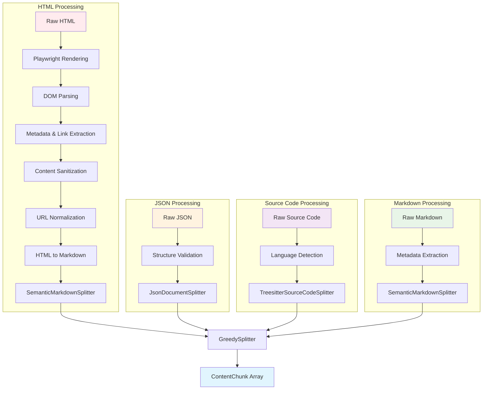

# Content Processing

## Overview

The content processing system transforms raw content from various sources into searchable document chunks through a modular strategy-pipeline-splitter architecture. The system handles web pages, local files, and package registries, processing different content types with specialized pipelines that preserve document structure while optimizing chunk sizes for embedding generation.

## Strategy Pattern Architecture

The content processing system uses the Strategy pattern to handle different content sources:

**Code Reference:**
- `src/scraper/types.ts` - ScraperStrategy interface definition
- `src/scraper/strategies/BaseScraperStrategy.ts` - Abstract base implementation
- `src/scraper/strategies/*.ts` - Concrete strategy implementations

## Architecture Components

### Scraper Strategies

Handle different content sources and coordinate the overall scraping process:

- **WebScraperStrategy**: HTTP/HTTPS URLs with JavaScript rendering support
- **LocalFileStrategy**: Local filesystem access with directory traversal
- **NpmScraperStrategy**: npm registry package documentation
- **PyPiScraperStrategy**: PyPI package documentation
- **GitHubScraperStrategy**: GitHub repository documentation

Each strategy manages URL discovery, scope filtering, and progress tracking while delegating content processing to pipelines.

### Content Fetchers

Abstract content retrieval across different sources:

- **HttpFetcher**: Web content with Playwright support, retry logic, and error handling
- **FileFetcher**: Local filesystem access with MIME type detection and encoding resolution

### Processing Pipelines

Transform raw content using middleware chains and content-type-specific logic:

- **HtmlPipeline**: Converts HTML to clean markdown via middleware, then applies semantic splitting
- **MarkdownPipeline**: Processes markdown with metadata extraction and semantic splitting
- **JsonPipeline**: Validates JSON structure and applies hierarchical splitting
- **SourceCodePipeline**: Handles programming languages with language detection and line-based splitting
- **TextPipeline**: Fallback for generic text content with basic processing

### Middleware System

Transform content through ordered middleware chains within pipelines:

**HTML Processing** uses the most extensive middleware pipeline, executed in a specific order to ensure correctness and efficiency:

- **Dynamic Content Rendering**: (Optional) Uses Playwright to render JavaScript-heavy pages when needed
- **DOM Parsing**: Converts the raw HTML string into a manipulable DOM object using Cheerio
- **Metadata Extraction**: Extracts the document title from `<title>` or `<h1>` tags in the full DOM
- **Link Discovery**: Gathers all links from the complete page for the crawler to potentially follow
- **Content Sanitization**: Removes large, irrelevant sections like navigation, footers, ads, and boilerplate
- **URL Normalization**: Cleans the _remaining_ content by converting relative image/link URLs to absolute ones and removing non-functional links (anchors, `javascript:`, etc.) while preserving their text content
- **Markdown Conversion**: Converts the final, cleaned, and normalized HTML into Markdown format

**Markdown Processing** applies lighter middleware:

- Front matter and metadata extraction
- Link processing and resolution

**JSON and Source Code** use minimal middleware to preserve structural integrity.

### Document Splitters

Segment content into semantic chunks while preserving document structure:

- **SemanticMarkdownSplitter**: Hierarchy-aware splitting based on heading structure
- **JsonDocumentSplitter**: Property-based hierarchical splitting for JSON files
- **TreesitterSourceCodeSplitter**: Semantic boundary detection for source code
- **TextDocumentSplitter**: Line-based fallback for unsupported content

### Size Optimization

**GreedySplitter** provides universal size optimization across all content types:

- Merges small chunks until reaching minimum size thresholds
- Respects semantic boundaries from content-specific splitters
- Handles oversized content while preserving document structure
- Ensures optimal chunk sizes for embedding generation

Chunk sizes are controlled by three character-based thresholds:

| Setting | Role |
|:--------|:-----|
| `minChunkSize` | Floor for merging -- chunks below this are combined with neighbors |
| `preferredChunkSize` | Soft target -- the optimizer splits when merging would exceed this |
| `maxChunkSize` | Hard ceiling -- no chunk body will exceed this value |

All sizes are measured in **characters** (`string.length`), not tokens. Before embedding,
a metadata header (page title, URL, section path) is prepended to each chunk, so the total
text sent to the embedding model is slightly larger than the chunk body. The actual token
count depends on the embedding model's tokenizer.

## Content Processing Flow

## Content-Type-Specific Processing

Different content types require specialized processing approaches while following the same overall pattern:

**Key Processing Differences:**

- **HTML**: Multi-stage middleware pipeline for web content cleaning and conversion
- **JSON**: Structural validation with hierarchical object/array splitting
- **Source Code**: Tree-sitter semantic boundary detection with language-specific parsing
- **Markdown**: Direct semantic splitting with metadata preservation

All content types converge on GreedySplitter for universal size optimization while preserving content-specific semantic boundaries.

## Two-Phase Splitting Architecture

### Phase 1: Semantic Splitting

Content-type-specific splitters preserve document structure:

**SemanticMarkdownSplitter** (HTML, Markdown):

- Analyzes heading hierarchy (H1-H6)
- Creates hierarchical paths like `["Guide", "Installation", "Setup"]`
- Preserves code blocks, tables, and list structures
- Maintains parent-child relationships

**JsonDocumentSplitter** (JSON):

- Object and property-level splitting
- Hierarchical path construction
- Concatenation-friendly chunk design
- Structural context preservation

**TextDocumentSplitter** (Source Code, Text):

- Line-based splitting with context
- Simple hierarchical structure
- Language-aware processing
- Temporary until syntax-aware implementation

### Phase 2: Size Optimization

**GreedySplitter** applies universal optimization:

- **Greedy Concatenation**: Merges small chunks until minimum size
- **Boundary Respect**: Preserves major section breaks (H1/H2 headings)
- **Metadata Merging**: Combines chunk metadata intelligently
- **Context Preservation**: Maintains hierarchical relationships

## Chunk Structure and Relationships

### Hierarchical Structure

Chunks maintain hierarchical relationships through path-based organization, enabling context-aware search and retrieval:

- **Parent**: Path with one fewer element
- **Children**: Paths extending current by one level
- **Siblings**: Same path length with shared parent
- **Context**: Related chunks automatically included in search results

### Search Context Retrieval

When returning search results, the system provides comprehensive context:

- The matching chunk itself
- Parent chunks for broader context
- Previous and following siblings for navigation
- Direct child chunks for deeper exploration

This approach ensures users receive coherent, contextual results regardless of content type.

## Error Handling and Quality Control

### Content Filtering

Automatic filtering of low-quality content:

- Navigation menus and sidebars
- Advertisement content and widgets
- Boilerplate text and templates
- Duplicate content detection
- Minimum content length thresholds

### Error Recovery

Graceful handling of processing errors:

- **Recoverable Errors**: Retry with backoff
- **Content Errors**: Skip and continue processing
- **Fatal Errors**: Stop with detailed error information
- **Warning Conditions**: Log and continue

### Progress Tracking

Real-time processing feedback:

- Page-level progress updates
- Processing rate metrics
- Error count and classification
- Memory usage monitoring

## System Integration

The content processing system integrates with downstream components through standardized interfaces:

- **Embedding Generation**: Consistent chunk formatting enables seamless vector generation across all content types
- **Database Storage**: Hierarchical paths and metadata support efficient indexing and retrieval
- **Search System**: Context-aware results leverage chunk relationships for comprehensive response generation
